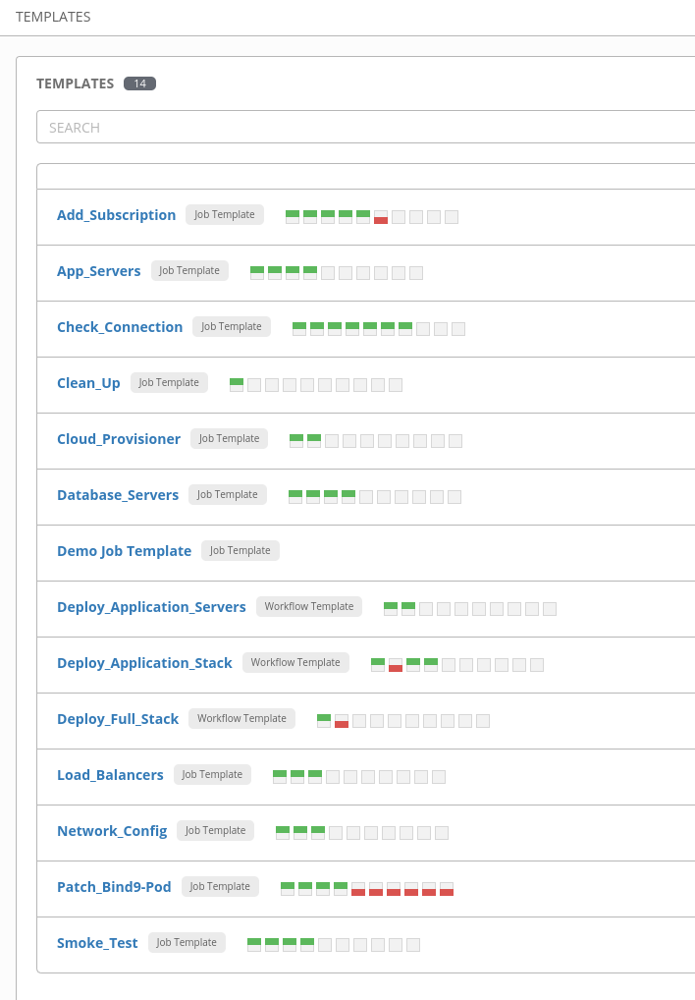
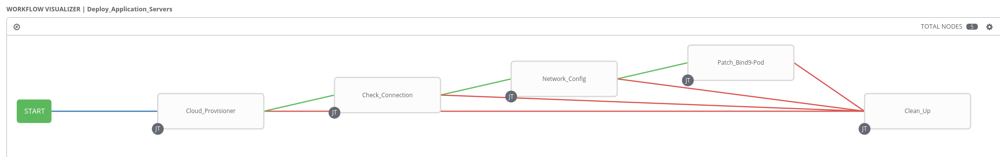
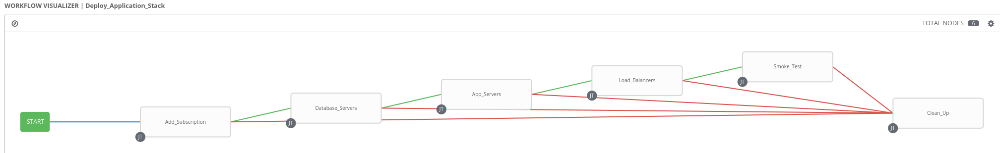

# Ansible Advanced v2 Final Lab

## Scenario and Summary
This lab introduces you to MitziCom who is adopting *Infrastructure as Code*. You will assist in setting up Ansible Tower and convert a monolithic playbook with reusable Ansible code while adhering to Ansible best practices.

## Deliverables
Split monolithic playbook into smaller playbooks, and convert into roles for code reuse. Playbooks and roles should be self-documenting. Setup Ansible Tower.

## Results
### Templates screenshot


### Workflow template visualizer screenshots
Deploy_Application_Servers workflow visualizer


Deploy_Application_Stack workflow visualizer


## Tower setup
* Create project
* Create credentials
  * OpenStack credentials
  * Machine credentials
* Create inventories
  * Static inventory for OpenStack and control
  * Dyanmic inventory to fetch OSP instances
* Create job and workflow templates

### Tower static inventory setup
Give the inventory a useful name: e.g.: **Control_Node**

Add `GUID: <your guid>` to inventory variables

Add a host named **control** with the following host variables:
```
ansible_ssh_host: control.{{ domain }}
```

Add a group named **control_node**. Inside the group add a host named **localhost** with the following host variables:
```
ansible_connection: local
ansible_python_interpreter: '{{ ansible_playbook_python }}'
```

### Tower dynamic inventory setup
Give the inventory a useful name: e.g.: **OpenStack_inventory**

Setup an source of type OpenStack. It should use the OpenStack credentials that have been created.

Create three groups, where each also has a subgroup.

Group name | Subgroup name
---------- | -------------
app_servers | meta-AnsibleGroup_app_servers
database_servers | meta-AnsibleGroup_database_servers
load_balancers | meta-AnsibleGroup_load_balancers
